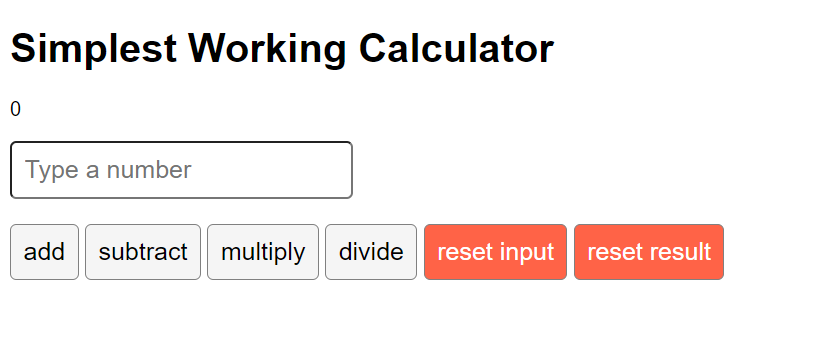

# Simplest Working Calculator

This is a simple calculator app built with React.js. It allows you to perform basic arithmetic operations such as addition, subtraction, multiplication, and division.

## Table of Contents

- [Introduction](#introduction)
- [Installation](#installation)
- [Usage](#usage)
- [Screenshot](#screenshot)
- [License](#license)

## Introduction

This calculator app is a simple React application that demonstrates the basic usage of React hooks (`useState` and `useRef`). It is designed to be a minimal example of a working calculator with basic functionalities.

## Installation

To install and run this project locally, follow these steps:

1. **Clone the repository:**
   ```bash
   git clone https://github.com/your-username/calculator-by-react.git
   ```
2. **Navigate to the project directory:**
   ```bash
   cd calculator-by-react
   ```
3. **Install the dependencies:**
   ```bash
   npm install
   ```
4. **Start the development server:**
   ```bash
   npm start
   ```

## Usage

To use the calculator app, follow these steps:

1. Open your web browser and navigate to `http://localhost:3000`.
2. Type a number in the input field.
3. Click on one of the operation buttons (`add`, `subtract`, `multiply`, `divide`) to perform the operation.
4. The result will be displayed above the input field.
5. Use the `reset input` button to clear the input field.
6. Use the `reset result` button to reset the result to 0.

## Screenshot


